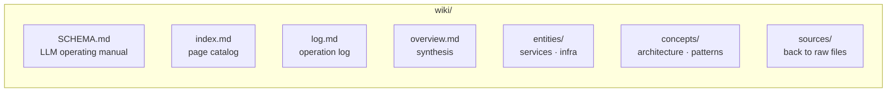

# AGENTS.md

## LLM Wiki

This project maintains an **LLM-maintained wiki** at `wiki/` — a structured, interlinked collection of markdown files that sits between raw source documents and LLM queries. The wiki is the persistent knowledge layer for this codebase.

### How the wiki works

The schema is defined in `wiki/SCHEMA.md`. Read it first — it defines the directory structure, page conventions, workflows (ingest, query, lint), and quality rules.

**Key principles:**

1. **The wiki is writeable. Raw sources are read-only.** When ingesting, read from raw sources but write only to wiki pages.
2. **Every operation touches multiple pages.** Ingesting a single source typically updates 5–15 wiki pages. Cross-references must be maintained.
3. **The index is the entry point.** When answering a question, read `wiki/index.md` first to locate relevant pages, then drill into them.
4. **File valuable answers.** If a query produces a non-trivial analysis, comparison, or insight, offer to save it as a new wiki page.
5. **Log everything.** Append entries to `wiki/log.md` for ingests, queries filed, and lint passes.

### Quick reference

| Task | Instructions |
|------|-------------|
| **Ingest a new source** | Read `wiki/SCHEMA.md#ingest-workflow`, then follow it |
| **Answer a question** | Read `wiki/index.md` → find relevant pages → read them → synthesize with citations |
| **Health check / lint** | Read `wiki/SCHEMA.md#lint-workflow` |
| **Update conventions** | Edit `wiki/SCHEMA.md` and discuss with the user |

### Directory structure

Raw sources live in their original project locations (`specs/`, `.specify/`, `services/`, `scripts/`, `README.md`, etc.). The wiki references them via relative links but never modifies them.
