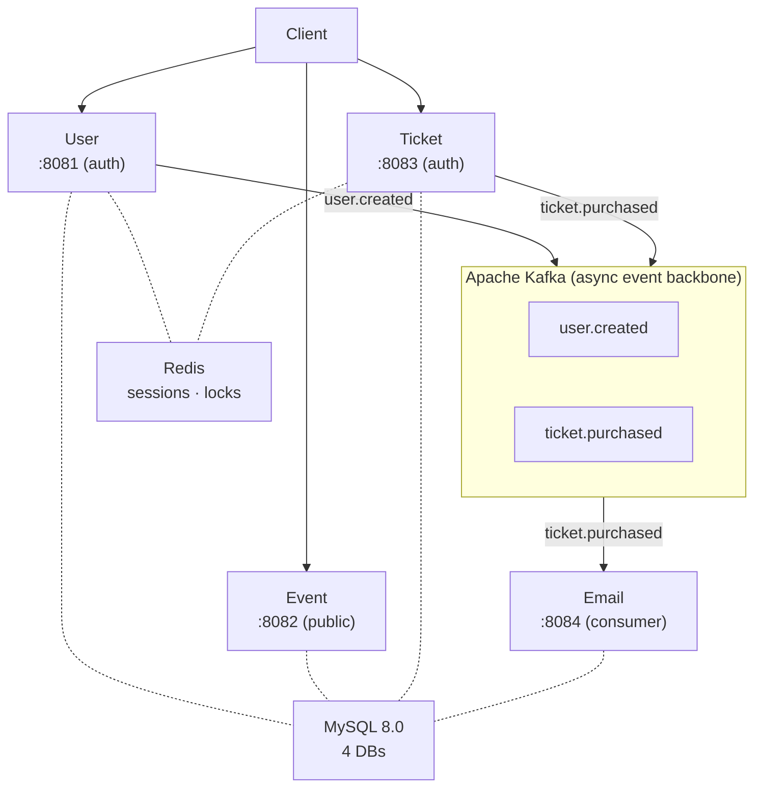
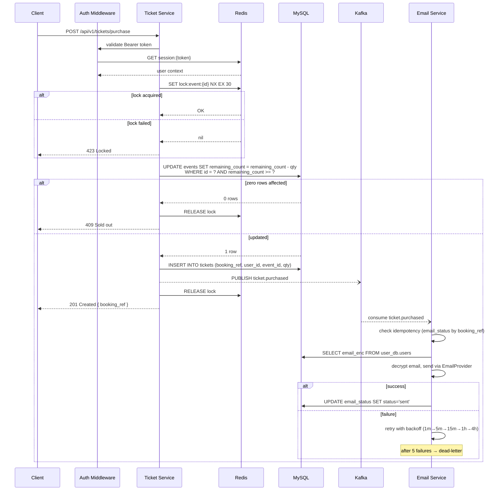
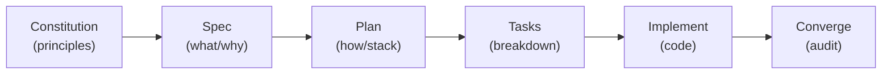
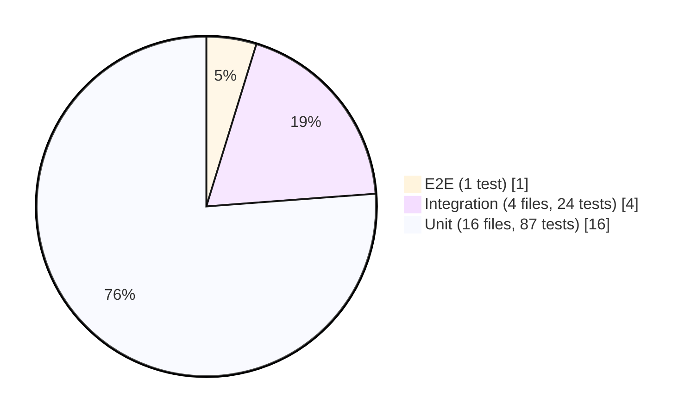
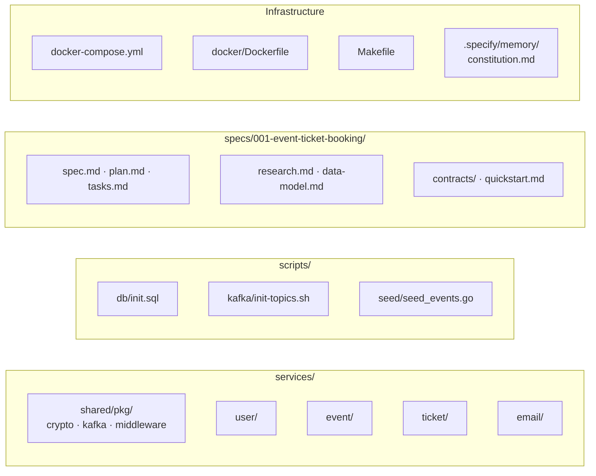

# Event Ticket Booking Platform

A distributed ticket reservation system demonstrating production-grade microservice architecture.
Built to solve concurrent inventory allocation under high contention — the classic "overselling"
problem. Designed by a human architect. Implemented by AI agents. Verified by automated gates.

---

## Table of Contents

- [Project Overview](#project-overview)
- [System Architecture](#system-architecture)
- [AI Orchestration & Development Workflow](#ai-orchestration--development-workflow)
- [Human-in-the-Loop (Quality Assurance)](#human-in-the-loop-quality-assurance)
- [Trade-offs & Future Scope](#trade-offs--future-scope)
- [Getting Started](#getting-started)
- [Testing](#testing)
- [API Reference](#api-reference)

---

## Project Overview

### The Problem

Online ticket sales have a hard constraint: you cannot sell the same seat twice. When thousands
of users click "buy" simultaneously for the last remaining tickets, the system must serialize
those requests, allocate correctly, and decline the rest — all in under two seconds.

### The Solution

Four independently deployable Go microservices, each owning a single bounded context:

| Service | Responsibility | Non-Negotiables |
|---------|---------------|-----------------|
| **User** | Identity, authentication, PII management | AES-256-GCM encryption at application layer; never log plaintext PII |
| **Event** | Public catalog of upcoming events | Read-only to unauthenticated visitors; pagination without N+1 queries |
| **Ticket** | Purchase flow with distributed locking | Redis-based distributed lock (per-event `SETNX` with Lua-script safe release); atomic inventory decrement; zero double-sells |
| **Email** | Async confirmation delivery | Kafka consumer with idempotency; exponential backoff retry; dead-letter audit trail |

### Key Metrics

- 100 concurrent purchasers contending for 1 ticket → exactly 1 wins, 99 are correctly declined
- Purchase confirmation delivered to the buyer in under 2 seconds (email excluded)
- Confirmation email sent within 5 minutes of purchase in 99% of cases
- All PII (email, name) encrypted at rest — verifiable by direct database inspection

---

## System Architecture

### Service Topology



### Data Flow: Purchase Request



### Design Rationale

**Why application-level encryption over MySQL TDE** — MySQL's Transparent Data Encryption
requires Enterprise Edition and encrypts at the file level, not the column level. Application-level
AES-256-GCM gives us column-level control, database agnosticism, and key management decoupled from
the database tier. The architecture supports upgrading to AWS KMS / HashiCorp Vault without code
changes.

**Why a Redis-based distributed lock over PostgreSQL advisory locks** — Advisory locks tie the lock lifecycle to a
database connection. In a microservice architecture where the lock holder may be a different process
from the DB connection owner, this breaks. Redis is connection-agnostic, purpose-built for
distributed mutual exclusion, and already in our stack for session management.

**Why Kafka over direct HTTP between services** — Synchronous HTTP calls couple service
availability. If the email service is down during a purchase spike, the purchase response blocks,
consumers wait, and the system degrades. Kafka decouples producer and consumer lifecycles: the
purchase returns in <2s regardless of email service health. Messages persist until consumed.

**Why session tokens over JWTs** — JWTs cannot be revoked without a blocklist (which requires
Redis anyway). Our Redis-backed opaque tokens give us instant revocation on logout, rolling TTL
refresh on activity, and zero-crypto token validation.

---

## AI Orchestration & Development Workflow

This project was built using a **specification-driven AI pipeline**. The human architect set the
vision; AI agents executed the implementation under strict constraints.

### The Pipeline



### Artifact Traceability

Every line of code traces back to a measurable requirement. The repository preserves the full
decision trail:

| Artifact | Location | Contains |
|----------|----------|----------|
| **Constitution** | `.specify/memory/constitution.md` | 4 non-negotiable principles governing all work |
| **Spec** | `specs/001-event-ticket-booking/spec.md` | 20 functional requirements, 8 success criteria, 3 user stories, edge cases |
| **Plan** | `specs/001-event-ticket-booking/plan.md` | Tech stack decisions, service decomposition, file layout |
| **Tasks** | `specs/001-event-ticket-booking/tasks.md` | 89 granular tasks across 7 phases, each with file paths and dependencies |
| **Research** | `specs/001-event-ticket-booking/research.md` | 8 technical decisions with rationale and rejected alternatives |
| **Data Model** | `specs/001-event-ticket-booking/data-model.md` | Entity schemas, indexes, constraints, state transitions |
| **Contracts** | `specs/001-event-ticket-booking/contracts/` | REST API specs and Kafka topic schemas |
| **Quickstart** | `specs/001-event-ticket-booking/quickstart.md` | Runnable validation scenarios |

### Parallel Agent Execution

The task breakdown was designed for parallel AI execution. Tasks marked `[P]` can run concurrently
(different files, no shared state). US1 (User) and US2 (Event) were implemented simultaneously by
separate agents after shared foundational packages were complete. US3 (Ticket + Email) was split
into two parallel tracks — Ticket Service and Email Service — each developed independently then
integrated through the Kafka contract.

---

## Human-in-the-Loop (Quality Assurance)

Automation is the engine. Human judgment is the steering wheel. Every phase included explicit
review gates where the architect validated output before the next phase began.

### Gate 1: Constitution (Principles)

Before any code was written, four non-negotiable principles were ratified:

1. **Security-First** — PII encrypted at rest (AES-256-GCM), keys never in source code, no
   plaintext PII in logs
2. **Concurrency Management** — Distributed locking mandatory for all ticket purchase operations,
   maximum 30-second lock TTL to prevent deadlock
3. **Service Decoupling** — All non-blocking operations (email, notifications, audit) MUST use
   asynchronous messaging; synchronous HTTP permitted only for immediate consistency requirements
4. **Test-Driven Development** — Unit + integration tests required for all core business logic
   before deployment; 80% minimum code coverage

These principles acted as an immutable constraint on every downstream decision. Any plan, task,
or implementation that violated a MUST principle was rejected until remediated.

### Gate 2: Spec (Clarification)

After the initial spec was generated, an ambiguity scan identified 4 unresolved decisions:

- Rate limiting strategy for auth endpoints → resolved: per-IP, 5/min login, 3/min register
- Data retention policy → resolved: Singapore PDPA compliance, soft deletion with PII anonymization
- Event filtering beyond pagination → resolved: deferred to v2
- Email dead-letter escalation → resolved: log correlation ID, queryable database records

Each decision was presented as a multiple-choice question with a recommended option based on
industry best practices. The architect selected the answer; the spec was updated atomically.

### Gate 3: Plan (Technical Blueprint)

Architecture decisions were researched and documented — not guessed. Each choice (Redis distributed lock,
application-level encryption, Kafka topic design, session management) includes the rejected
alternatives and the rationale for rejection. This ensures future maintainers understand not just
*what* was chosen, but *why other options were excluded*.

### Gate 4: Convergence (Code Audit)

After implementation, a convergence audit compared the final codebase against all 20 functional
requirements, 3 buildable success criteria, and 4 constitution principles. The audit found 27 gaps
ranging from CRITICAL (hardcoded encryption key) to LOW (test TTL precision). All 27 were
triaged, assigned severity, and remediated in a dedicated Phase 7 before the project was
declared complete.

### Testing Pyramid



All run without Docker, MySQL, or Kafka. 21 test files, 112 test functions total.

21 test files (87 unit + 24 integration + 1 e2e = 112 test functions). Zero external dependencies
at test time.

---

## Trade-offs & Future Scope

Every architecture is a series of trade-offs. Here are the ones we made consciously.

### What's In Scope (v1)

- User registration with encrypted PII storage and session-based authentication
- Public event catalog with pagination and sold-out indicators
- Concurrent ticket purchase with distributed locking (zero double-sells)
- Async confirmation email delivery via Kafka with retry and dead-letter handling
- Rate limiting on authentication endpoints (per-IP)
- Account deletion with PII anonymization (Singapore PDPA compliant)

### What's Deferred (Future Scope)

| Area | v1 Decision | Why Deferred |
|------|-------------|--------------|
| **Payment processing** | Purchase = reserving a ticket; no payment integration | Separates inventory concern from financial concern; payment adds PCI compliance scope |
| **Event management UI** | Events loaded via seed data; no admin CRUD | Admin UX is a separate bounded context; seed data suffices for MVP validation |
| **Multi-factor auth** | Password-only authentication | Adds infrastructure (SMS/OTP/TOTP) without changing core ticket flow; can layer on later |
| **Event search/filtering** | Pagination only; no keyword, date range, or venue filters | Premature optimization without production traffic patterns; pagination alone validates the catalog model |
| **Multi-region deployment** | Single-region; PostgreSQL-compatible schema | Cross-region Redis lock coordination adds significant complexity; v1 validates single-region first |
| **OAuth/social login** | Email + password only | Adds third-party provider dependency; orthogonal to ticket purchase flow |
| **Kubernetes manifests** | Docker Compose for local dev | Compose is sufficient for the 4-service topology; K8s adds overhead with no local-dev benefit |
| **gRPC between services** | Cross-service reads use shared MySQL (same Docker network) | Premature optimization; shared DB reads are acceptable for v1; future: add service-to-service APIs |
| **Production monitoring** | Structured logging with correlation IDs; no metrics/alerting | Logging provides debug trail; metrics require infrastructure (Prometheus/Grafana) not needed at MVP stage |
| **Configurable email provider** | LogProvider (stdout) implemented; real SMTP/SendGrid is a swap-in | Provider interface is pluggable; real provider config is a deploy-time concern, not a code concern |

### Known Technical Debt (Documented)

- Ticket Service reads `event_db` directly for event availability checks (cross-database query).
  Tagged with `TODO(v2)` — future iteration should use Event Service API calls.
- `docker/Dockerfile` uses Debian base image (glibc) to avoid Alpine musl linker issues with the
  confluent-kafka-go C library. The dependency on a vendored C library for Kafka is the only
  non-Go-native component in the stack.

---

## Getting Started

### Prerequisites

- Docker & Docker Compose v2+
- Go 1.25+ (for local development and testing)
- `make` (optional)

### Run the Platform

```bash
cp .env.example .env
# IMPORTANT: Generate a real encryption key before starting services
# ENCRYPTION_KEY=$(openssl rand -base64 32)  # macOS/Linux, or generate one manually
# Then edit .env and paste it as the ENCRYPTION_KEY value
docker compose up -d
docker compose ps          # wait for all services to show "healthy"
make seed                  # insert 6 sample events (including one sold-out)
```

### Smoke Test

```bash
# Register
curl -X POST http://localhost:8081/api/v1/users/register \
  -H "Content-Type: application/json" \
  -d '{"name":"Jane Doe","email":"jane@example.com","password":"secure123"}'

# Login
TOKEN=$(curl -s -X POST http://localhost:8081/api/v1/users/login \
  -H "Content-Type: application/json" \
  -d '{"email":"jane@example.com","password":"secure123"}' | jq -r '.token')

# Browse (public, no auth)
curl http://localhost:8082/api/v1/events | jq

# Purchase
curl -X POST http://localhost:8083/api/v1/tickets/purchase \
  -H "Authorization: Bearer $TOKEN" \
  -H "Content-Type: application/json" \
  -d '{"event_id":1,"quantity":2}'

# Verify PII encryption
docker compose exec mysql mysql -u root -prootpassword -e \
  "SELECT id, name_enc, email_enc, email_hash FROM user_db.users LIMIT 1;"
# → name_enc and email_enc are binary blobs. No plaintext PII visible.
```

### Running Tests

```bash
make test-unit          # 18 unit tests (no Docker needed)
make test-integration   # 4 integration tests (full HTTP stack per service)
make test-concurrency   # Distributed lock stress test (100 goroutines)
make test-e2e           # Cross-service smoke test (register → login → browse)
```

Every test runs without Docker, MySQL, or Kafka. Tests use `miniredis` (embedded Redis) and mock
repositories. The full suite completes in under 15 seconds.

---

## API Reference

### User Service (`:8081`)

| Method | Path | Auth | Description |
|--------|------|------|-------------|
| `POST` | `/api/v1/users/register` | — | Create account. Rate limited: 3/min per IP. |
| `POST` | `/api/v1/users/login` | — | Authenticate. Returns session token. Rate limited: 5/min per IP. |
| `POST` | `/api/v1/users/logout` | Bearer | Invalidate current session. |
| `POST` | `/api/v1/users/delete` | Bearer | Delete account. PII anonymized; ticket records preserved. |
| `GET` | `/api/v1/users/me` | Bearer | Return authenticated user's profile. |

### Event Service (`:8082`)

| Method | Path | Auth | Description |
|--------|------|------|-------------|
| `GET` | `/api/v1/events` | — | List upcoming events. Query: `?page=1&per_page=20`. Response includes nested `pagination` object. |
| `GET` | `/api/v1/events/{id}` | — | Event detail with description, capacity, remaining count. |

### Ticket Service (`:8083`)

| Method | Path | Auth | Description |
|--------|------|------|-------------|
| `POST` | `/api/v1/tickets/purchase` | Bearer | Purchase tickets. Body: `{"event_id": 1, "quantity": 2}`. Returns booking reference. |
| `GET` | `/api/v1/tickets` | Bearer | Purchase history with nested event details and pagination. |

### Email Service (`:8084`)

The Email Service is a pure Kafka consumer — it has no public REST API beyond the health check. It
consumes `ticket.purchased` events, decrypts the buyer's email from `user_db`, sends a confirmation
via a pluggable `EmailProvider` interface, and records delivery status in `email_db.email_status`.
Failed deliveries are retried with exponential backoff (1m → 5m → 15m → 1h → 4h) and dead-lettered
after 5 attempts. Dead-lettered records remain queryable via the database for manual investigation.

| Method | Path | Auth | Description |
|--------|------|------|-------------|
| `GET` | `/health` | — | Health check |

### Response Conventions

All errors follow a consistent shape:

```json
{ "error": "human-readable message describing what went wrong" }
```

HTTP status codes map to semantic outcomes:

| Code | Meaning |
|------|---------|
| `201` | Purchase confirmed; booking reference returned |
| `400` | Invalid input (short password, invalid email, negative quantity) |
| `401` | Missing or expired session token |
| `409` | Sold out or insufficient tickets available |
| `423` | Lock contention; another purchase is in progress; retry with backoff |

---

## Project Structure



---

## Governance

All development is governed by the [Project Constitution](.specify/memory/constitution.md). Any
pull request that violates a MUST principle is rejected. Architecture deviations require explicit
justification in the implementation plan. The constitution is versioned (semver) and amended
through a documented process requiring rationale, impact assessment, migration plan, and approval.

---

## Troubleshooting

- **Service fails to start**: `docker compose logs <service>` — typically MySQL health check hasn't passed yet.
- **Kafka topics not created**: `docker compose exec kafka kafka-topics --list --bootstrap-server localhost:9092`
- **Lock contention (HTTP 423)**: Expected under high concurrency. Clients should retry with exponential backoff.
- **Email not delivered**: Check `docker compose logs email` and query `email_db.email_status` for dead-letter records.
