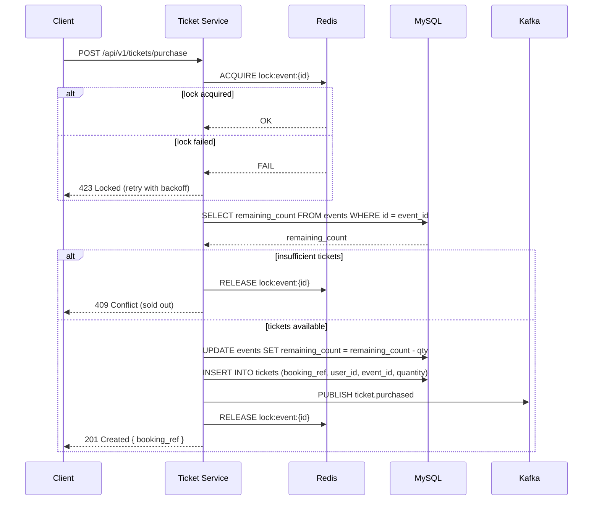

# Ticket Service API Contract

**Base Path**: `/api/v1/tickets`

All endpoints require authentication via `Authorization: Bearer <token>`.

## Endpoints

### POST /tickets/purchase

Purchase tickets for an event. Acquires a distributed lock on the event, checks availability,
decrements inventory, and publishes a `ticket.purchased` Kafka event.

**Headers**: `Authorization: Bearer <token>`

**Request**:
```json
{
  "event_id": 1,
  "quantity": 2
}
```

**Response 201** (success):
```json
{
  "booking_ref": "TBK-A3F8X2K1",
  "event": {
    "id": 1,
    "name": "Summer Music Festival",
    "date": "2025-08-15T18:00:00Z",
    "venue": "Central Park Amphitheater"
  },
  "quantity": 2,
  "purchased_at": "2025-07-14T14:30:00Z"
}
```

**Response 409** (insufficient tickets):
```json
{
  "error": "Not enough tickets available. Requested: 6, Available: 5"
}
```

**Response 409** (sold out):
```json
{
  "error": "This event is sold out"
}
```

**Response 400** (past event):
```json
{
  "error": "Cannot purchase tickets for an event that has already occurred"
}
```

**Response 423** (concurrent contention):
```json
{
  "error": "Tickets are currently being purchased by other users. Please try again."
}
```

**Response 400** (invalid quantity):
```json
{
  "error": "Quantity must be greater than 0"
}
```

---

### GET /tickets

List the authenticated user's purchase history.

**Headers**: `Authorization: Bearer <token>`

**Query Parameters**:
- `page` (optional, default: 1)
- `per_page` (optional, default: 20, max: 100)

**Response 200**:
```json
{
  "tickets": [
    {
      "booking_ref": "TBK-A3F8X2K1",
      "event": {
        "id": 1,
        "name": "Summer Music Festival",
        "date": "2025-08-15T18:00:00Z",
        "venue": "Central Park Amphitheater"
      },
      "quantity": 2,
      "status": "confirmed",
      "purchased_at": "2025-07-14T14:30:00Z"
    }
  ],
  "pagination": {
    "page": 1,
    "per_page": 20,
    "total": 3
  }
}
```

---

## Purchase Flow (Internal)



**Error handling**:
- If MySQL UPDATE/INSERT fails after lock acquired: release lock, return 500
- If Kafka publish fails: log error, do NOT roll back ticket (FR-016: must not lose purchase)
- Lock automatically expires after 30s TTL if service crashes mid-flow
