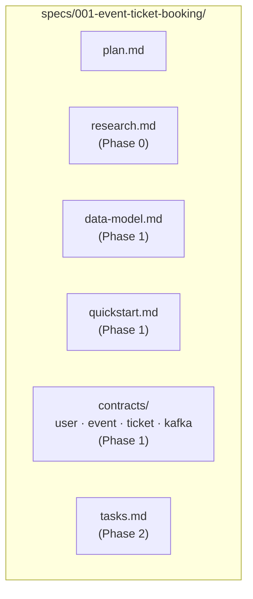
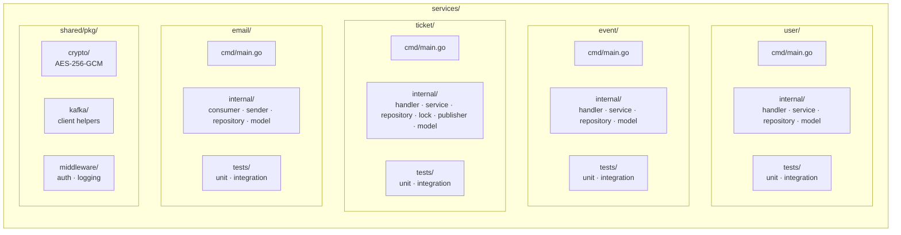

# Implementation Plan: Event Ticket Booking Platform

**Branch**: `001-event-ticket-booking` | **Date**: 2025-07-14 | **Spec**: [spec.md](./spec.md)

**Input**: Feature specification from `/specs/001-event-ticket-booking/spec.md`

**Note**: This template is filled in by the `/speckit.plan` command; its definition describes the execution workflow.

## Summary

Build a microservices-based event ticket booking platform with four services: User Service
(registration, auth, encrypted PII storage), Event Service (public event catalog), Ticket
Service (concurrent purchase with Redis-backed distributed locking), and Email Service
(Kafka consumer for async confirmation emails). Infrastructure runs via Docker Compose with Go
backends, MySQL for persistence, Redis for locking/sessions, and Kafka for async messaging.

## Technical Context

**Language/Version**: Go 1.22+

**Primary Dependencies**: net/http (stdlib router), gorilla/mux for routing,
bcrypt for password hashing, AES-256-GCM for PII encryption, go-redis for Redis, sarama or
confluent-kafka-go for Kafka, go-sql-driver/mysql for MySQL

**Storage**: MySQL 8.0 (user profiles, events, tickets/orders)

**Caching/Locking**: Redis 7 (session tokens, distributed locks via Redlock)

**Message Broker**: Apache Kafka (async events: `user.created`, `ticket.purchased`)

**Testing**: Go standard testing package + testify for assertions + httptest for API tests

**Target Platform**: Linux containers (Docker Compose for local dev, Kubernetes-ready)

**Project Type**: Web service (microservices backend, no frontend in v1)

**Performance Goals**: <2s purchase confirmation (SC-005), <5min email delivery (SC-006),
100 concurrent purchase requests on single ticket with zero double-sells (SC-004)

**Constraints**: PII encrypted at rest (AES-256-GCM), distributed lock TTL max 30s,
async email delivery (non-blocking), event sourcing via Kafka for audit trail

**Scale/Scope**: 4 microservices, ~1000 concurrent users target, single-region deployment

## Constitution Check

*GATE: Must pass before Phase 0 research. Re-check after Phase 1 design.*

| Principle | Compliance | Evidence |
|-----------|-----------|----------|
| **I. Security-First** | PASS | AES-256-GCM encryption for PII (name, email) at application layer before MySQL write. Keys via env vars (KMS-ready for production). No plaintext PII in logs. |
| **II. Concurrency Management** | PASS | Redis Redlock for distributed locking on ticket purchase operations. Lock per event ID. 30s max TTL. Lock acquisition check before inventory decrement. |
| **III. Service Decoupling** | PASS | Kafka topics `user.created`, `ticket.purchased` for async cross-service communication. Email Service consumes `ticket.purchased` to send confirmation emails without blocking the purchase flow. Idempotent consumers with correlation IDs. |
| **IV. Test-Driven Development** | PASS | Unit tests for all business logic (encryption, locking, validation). Integration tests for purchase concurrency, MySQL persistence, Kafka message flow. 80% core logic coverage target. |

**Gate Result**: ALL PASS — no violations to justify.

## Project Structure

### Documentation (this feature)

### Source Code (repository root)

**Structure Decision**: Monorepo with 4 Go microservices under `services/`. Each service
follows the same internal layout (cmd/, internal/, tests/). Shared code (encryption, Kafka
helpers, middleware) lives in `services/shared/pkg/`. Docker Compose orchestrates all services
plus infrastructure (MySQL, Redis, Kafka, Zookeeper).

## Complexity Tracking

> **Fill ONLY if Constitution Check has violations that must be justified**

No violations. All constitution principles are satisfied by the proposed architecture.
