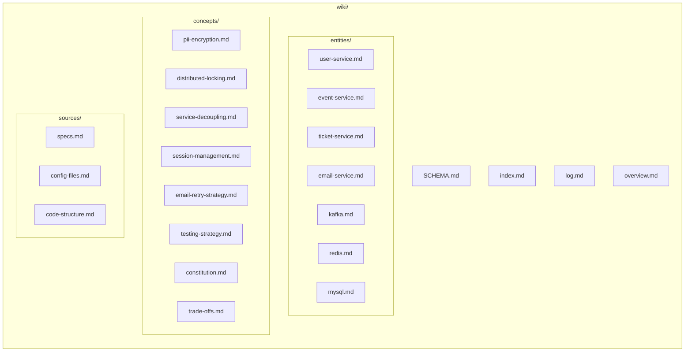

# Wiki Schema & Conventions

This document defines the structure, conventions, and workflows for maintaining this project's LLM Wiki. The LLM uses this as its operating manual — every ingest, query, lint, and edit follows these rules.

---

## Directory Structure



**Raw sources** live outside the wiki, in their original project locations:
- `specs/001-event-ticket-booking/` — spec, plan, tasks, research, data model, contracts
- `.specify/memory/constitution.md` — governing principles
- `README.md` — project overview
- `services/` — source code
- `scripts/` — database init, seed data, Kafka topic setup
- `docker-compose.yml`, `.env.example` — infrastructure config

The wiki layer is read/write by the LLM. Raw sources are read-only — the LLM reads them but never modifies them.

---

## Page Conventions

### Frontmatter

Every wiki page starts with YAML frontmatter:

```yaml
---
title: "Page Title"
category: "entity | concept | source-map"
tags: [tag1, tag2, ...]
source_count: N
updated: YYYY-MM-DD
---
```

- `title` — display title (used in index, backlinks)
- `category` — one of `entity`, `concept`, `source-map`
- `tags` — lowercase, categorizes the page for grouping and Dataview queries
- `source_count` — number of raw sources this page draws from (increment on each relevant ingest)
- `updated` — last modification date (ISO format)

### Body Structure

**Entity pages** describe a tangible component of the system:
1. `## Overview` — what it is, its role
2. `## Responsibilities` — what it owns/does
3. `## Interfaces` — API, contracts, dependencies
4. `## Data Model` — schema, state, constraints (link to data-model.md in sources/)
5. `## Cross-references` — links to related entity pages, concept pages, source pages
6. `## Key Decisions` — notable choices about this entity

**Concept pages** describe an idea, pattern, decision, or trade-off:
1. `## Overview` — what the concept is
2. `## Rationale` — why it was chosen
3. `## Alternatives` — what was considered and rejected
4. `## Implementation` — how it's realized in the codebase
5. `## Trade-offs` — pros, cons, known issues
6. `## Cross-references` — which entities use this concept, related concepts

**Source-map pages** catalog raw source files and what's in them:
1. `## Overview` — what this source group contains
2. `## Files` — table: file path, description, key wiki pages it maps to
3. `## Ingest History` — which wiki pages were created/updated from these sources, when

### Linking Convention

- Links to other wiki pages use `[[page-name]]` WikiLink syntax (Obsidian-compatible)
- Links to raw source files use relative paths: `[filename](../specs/001-event-ticket-booking/spec.md)`
- Links to external resources use full URLs

### Naming Convention

- Entity pages: `{entity-name}.md` (e.g., `user-service.md`)
- Concept pages: `{concept-name}.md` (e.g., `pii-encryption.md`)
- Source pages: `{source-group}.md` (e.g., `specs.md`)
- Use kebab-case for all filenames. Lowercase.

---

## Workflows

### Ingest Workflow

When the user drops a new source or asks the LLM to ingest existing sources:

1. **Read** the raw source(s) the user points to.
2. **Discuss** key takeaways with the user before writing. Ask: what's notable? What should be emphasized? What's ambiguous?
3. **Write/update** wiki pages:
   - Create new entity or concept pages if the source introduces something new
   - **Update all affected existing pages** — a single source often touches 5–15 pages
   - Update cross-reference sections on affected pages
   - Update source_count in frontmatter on all modified pages
   - Update `sources/` source-map pages to reflect the new mapping
4. **Update index.md** — add any new pages with link and one-line summary; update summaries for modified pages if the summary is now stale
5. **Append to log.md** — use format: `## [YYYY-MM-DD] ingest | Source Title`
   - Body: list of pages created/modified, key insights from the source, user direction notes
6. **Inform the user** — brief summary of what was created and what was updated

### Query Workflow

When the user asks a question about the project:

1. **Read index.md** to locate relevant pages.
2. **Read** the identified wiki pages (not the raw sources, unless the wiki pages are stale or incomplete).
3. **Synthesize** an answer with citations to wiki pages and optionally to raw sources.
4. **Offer to file** the answer as a new wiki page if it represents a non-trivial analysis, comparison, or connection worth preserving. If the user says yes, file it under the appropriate category, update index.md, and append to log.md as a query entry.

### Lint Workflow

When the user asks for a health check:

1. **Read index.md** to get the full page catalog.
2. **Check for contradictions** — read pairs of pages that address overlapping topics, flag inconsistencies.
3. **Check for staleness** — compare `updated` dates against log.md entries; flag pages not updated after relevant recent ingests.
4. **Check for orphans** — read cross-reference sections across all pages, identify pages with zero inbound links.
5. **Check for gaps** — important concepts mentioned but lacking their own page.
6. **Check for missing cross-references** — entities or concepts that appear in a page but aren't linked.
7. **Report findings** to the user with suggested actions (create page X, update section Y, add link Z).
8. **Append to log.md** — use format: `## [YYYY-MM-DD] lint | Health Check`

---

## Quality Rules

1. **One idea per page.** If a page starts covering two distinct concepts, split it.
2. **Cross-references are not optional.** Every entity page links to the concepts it uses. Every concept page links to the entities that implement it. Every source page links to the wiki pages derived from it.
3. **Page summaries in index.md must stay current.** If you update a page and the one-liner in the index is now misleading, update the index.
4. **Prefer markdown over other formats** — wiki pages should be readable in any markdown editor (Obsidian, VS Code, GitHub).
5. **Dates are ISO 8601** (YYYY-MM-DD). Timestamps in log.md use full ISO: `YYYY-MM-DD HH:MM`.
6. **Tags are lowercase kebab-case**, no spaces (e.g., `distributed-locking`, `pii`, `kafka`).
7. **When in doubt, ask the user** before making a judgment call. The human is the curator; the LLM is the librarian.
