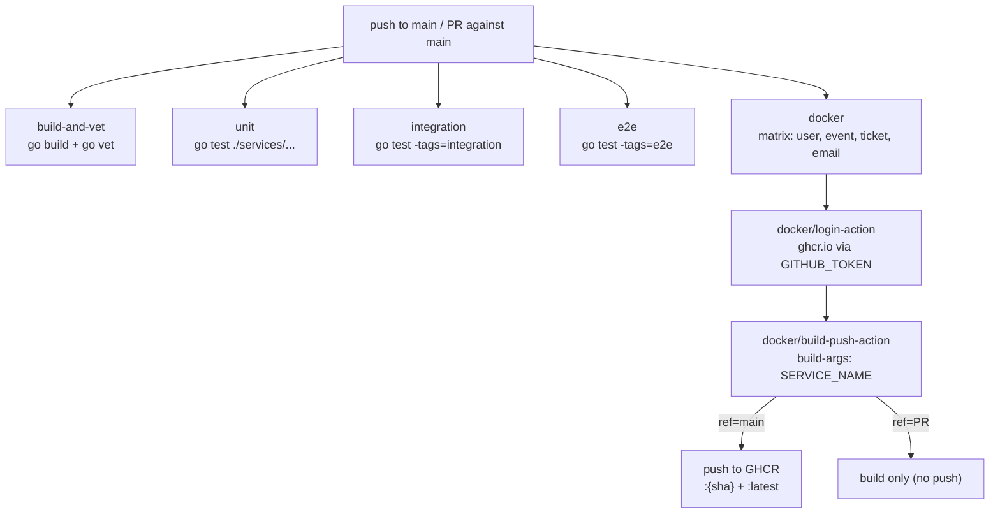

# CI/CD Pipeline

## Overview

The CI pipeline runs on every push to `main` and every pull request against `main`. It validates code quality, runs the full test suite, and builds + pushes Docker images to GitHub Container Registry (GHCR). The pipeline uses GitHub Actions with a matrix strategy for parallel execution.

## Pipeline Jobs



## Docker Build & Push

| Aspect | Detail |
|--------|--------|
| **Registry** | GitHub Container Registry (`ghcr.io`) |
| **Auth** | Built-in `GITHUB_TOKEN` — no secrets needed |
| **Image path** | `ghcr.io/ryanongwk/event-ticket-booking-platform/{service}` |
| **Tags** | `:{git-sha}` (immutable) + `:latest` (movable) |
| **Build context** | Root of repo — copies `go.mod`, `go.sum`, `services/shared/`, `services/{SERVICE_NAME}/` |
| **Dockerfile** | `docker/Dockerfile` (multi-stage, parameterized by `SERVICE_NAME` arg) |
| **Caching** | GitHub Actions cache (`type=gha`) — main writes, PRs read |
| **Concurrency** | `cancel-in-progress: true` — rapid pushes cancel earlier workflow runs |

### PR vs Main Behavior

| Trigger | Build? | Push to GHCR? |
|---------|:------:|:-------------:|
| PR opened/updated against `main` | Yes | No (validates Dockerfile without polluting registry) |
| Push to `main` | Yes | Yes (pushes both tags) |

## Registry Layout

CI produces 4 images per main push:

```
ghcr.io/ryanongwk/event-ticket-booking-platform/
├── user:{sha}     user:latest
├── event:{sha}    event:latest
├── ticket:{sha}   ticket:latest
└── email:{sha}    email:latest
```

`docker-compose.yml` references these images alongside its `build:` blocks — `docker compose up` builds locally, `docker compose pull` fetches pre-built CI images.

## Current Gaps

- No Docker image scanning (Trivy/Grype)
- No deployment step — CI builds images but does not deploy
- No `golangci-lint` or `govulncheck` linting/security scan jobs
- No code coverage reporting or threshold enforcement
- No K8s manifests for production deployment

## Test Jobs

| Job | Command | Coverage |
|-----|---------|----------|
| `unit` | `go test ./services/...` | All unit tests (87 functions) |
| `integration` | `go test -tags=integration ./services/...` | All integration tests (24 functions) |
| `e2e` | `go test -tags=e2e ./services/e2e/...` | Cross-service smoke test (1 test) |

All tests run without Docker, MySQL, or Kafka. See [[testing-strategy]].

## Cross-references

- [[testing-strategy]] — test pyramid and practices
- [[constitution]] — CI gates (pre-commit lint, PR tests, deployment approval)
- [[trade-offs]] — Kubernetes and monitoring deferred beyond v1
- [[sources/config-files]] — CI workflow file location
- [[overview]] — system architecture context
