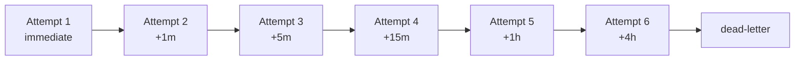
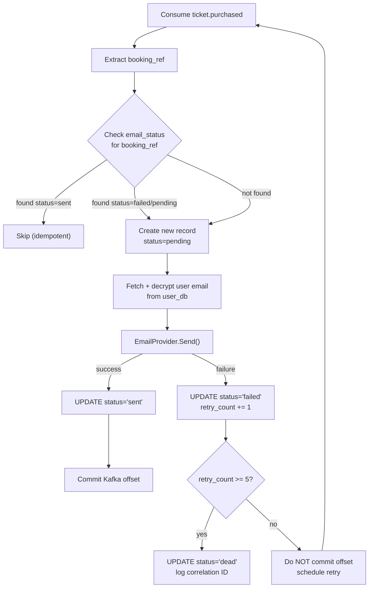

# Email Retry Strategy

## Overview

The [[email-service]] uses exponential backoff for failed email deliveries, with a dead-letter mechanism after 5 failed attempts. This ensures that transient failures (SMTP timeout, rate limiting, network blip) are retried, while persistent failures (invalid email, provider outage) are surfaced for manual investigation.

## Retry Schedule



After 5 failures (6 total attempts including the initial), status transitions to `dead`. The record remains queryable in `email_db.email_status` for manual investigation.

### Timeout Provision

If an email delivery has not succeeded within 24 hours of creation, status transitions to `dead` regardless of retry count.

## Implementation

### Consumer Processing



### Idempotency

The `booking_ref` (from the `ticket.purchased` event) serves as the idempotency key. The consumer checks `email_status` for an existing record with that key before processing. This handles:
- Kafka at-least-once delivery (duplicate messages)
- Consumer restart before offset commit
- Manual retry of dead-lettered records

## Pluggable Provider Interface

```go
type EmailProvider interface {
    Send(ctx context.Context, to string, subject string, body string) error
}
```

Current implementation: `LogProvider` (stdout). Real SMTP/SendGrid/Mailgun providers are a deploy-time swap-in — no business logic changes needed.

## Dead-Letter Investigation

When a record reaches `dead` status:
- The correlation ID is logged for traceability
- The record persists in `email_db.email_status` with full failure history
- Manual investigation: query by `status='dead'`, review retry_count and last_attempt_at

## Cross-references

- [[email-service]] — implements this strategy
- [[kafka]] — message delivery and offset management
- [[ticket-service]] — producer of purchase events (booking_ref)
- [[pii-encryption]] — email decryption at read time
- [[constitution]] — Principle III (Service Decoupling), idempotency requirement
- [[trade-offs]] — dead-letter escalation decision
