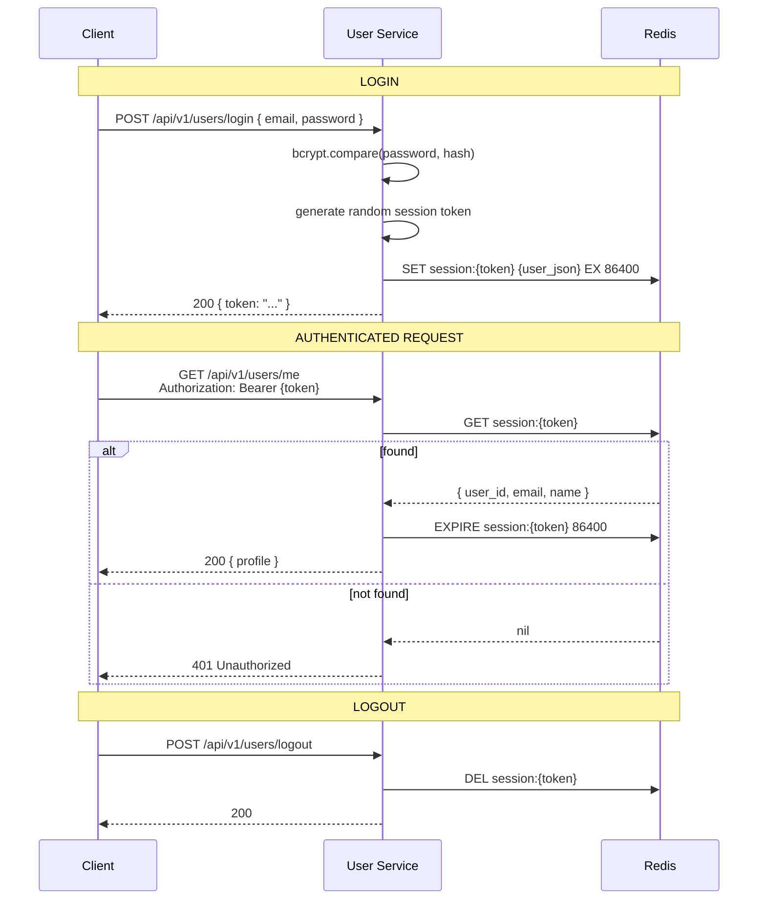

# Session Management

## Overview

Authentication uses Redis-backed opaque session tokens rather than JWTs. Tokens are stored server-side in [[redis]] with a 24-hour TTL and rolling refresh on activity. The auth middleware validates every authenticated request by looking up the token in Redis.

## Rationale

**Why opaque session tokens over JWTs:**

- **Instant revocation**: Logout = DELETE the Redis key. JWT revocation requires a blocklist (which needs Redis anyway) or waiting for token expiry.
- **Smaller headers**: JWTs carry the full payload in the token. Opaque tokens are just a random string — the payload lives in Redis.
- **No crypto overhead per request**: JWT validation requires signature verification. Redis lookup is a simple GET.
- **Rolling TTL**: Every authenticated request refreshes the TTL. Active users stay logged in. Inactive users are automatically logged out after 24h.
- **Zero-crypto token validation**: The middleware just checks if the key exists in Redis.

## Implementation

### Token Format

Random opaque string (e.g., UUID v4 or secure random bytes, hex-encoded).

### Redis Schema

```
Key:   session:{token}
Value: JSON { user_id, email, name, created_at }
TTL:   24 hours (refreshed on each authenticated request)
```

### Flow



### Account Deletion

On account deletion (`POST /api/v1/users/delete`):
- User's PII is anonymized (name → "[deleted]", email hash preserved for audit)
- Session token is deleted (immediate logout)
- Ticket records preserved (booking_ref, event_id, quantity retained without PII link)

## Alternatives Considered

| Alternative | Why Rejected |
|-------------|-------------|
| JWT stateless tokens | No built-in revocation without a blocklist (requires Redis anyway). Larger payload in every request header. |
| Database-stored sessions | Adds read load to MySQL for every authenticated request. Redis is purpose-built for key-value lookups. |

## Cross-references

- [[redis]] — session store
- [[user-service]] — session creation, validation, deletion
- [[ticket-service]] — validates sessions via auth middleware
- [[pii-encryption]] — complementary security concern
- [[constitution]] — Principle I (Security-First) context
