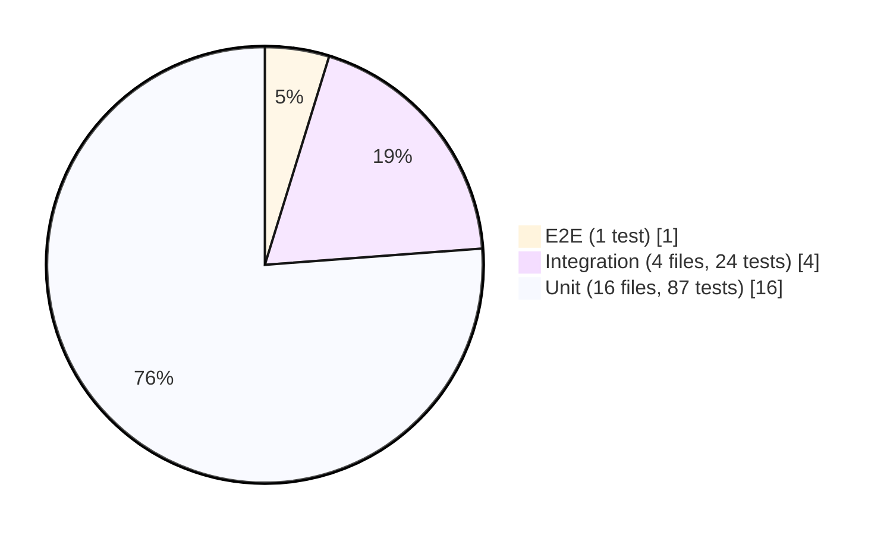

# Testing Strategy

## Overview

Testing is a first-class concern with 112 test functions across three levels. All tests run without Docker, MySQL, or Kafka — the full suite completes in under 15 seconds. Testing is a MUST principle under the [[constitution]] (Principle IV: Test-Driven Development).

## Test Pyramid



All run without Docker, MySQL, or Kafka. 21 test files, 112 test functions total.

### Unit Tests (87)
- **Scope**: Individual functions in isolation
- **Dependencies**: Mocked (mock repositories, mock providers)
- **Speed**: <1ms per test
- **Tools**: Go standard `testing` package, `testify/mock`
- **Example**: Test that `purchase()` correctly rejects when `remaining_count < requested quantity`

### Integration Tests (24)
- **Scope**: Full HTTP router with real middleware, mock repositories
- **Dependencies**: `miniredis` (embedded Redis), mock MySQL repos
- **Speed**: ~10-50ms per test
- **Example**: Full purchase flow through HTTP handler: acquire lock → decrement → insert → return booking_ref

### E2E Tests (1)
- **Scope**: Cross-service smoke test
- **Flow**: register → login → browse events → purchase
- **Purpose**: Validates that services integrate correctly end-to-end

## Zero External Dependencies at Test Time

All tests use:
- `miniredis` — embedded Go Redis server (no Docker Redis needed)
- Mock repositories — no MySQL connection needed
- Mock Kafka producers — no Kafka broker needed

This is critical: tests must be runnable in CI without infrastructure, and must complete in under 15 seconds to not slow down the development feedback loop.

## Concurrency Stress Test

```
make test-concurrency   # Distributed lock stress test (100 goroutines)
```

100 concurrent goroutines contend for 1 ticket. Verification: exactly 1 wins, 99 are correctly declined. This directly validates the [[distributed-locking]] implementation.

## Constitution Requirements

- "All core business logic MUST be covered by unit tests AND integration tests before deployment"
- "Minimum code coverage for core business logic: 80%"
- "Tests MUST be written before implementation (TDD: Red → Green → Refactor)"

## Coverage Gaps (Known)

- Kafka consumer integration is tested at the unit level (mock consumer), not with a real Kafka broker
- Cross-database read paths (Ticket → Event DB) tested via mock, not real MySQL
- Email provider integration tested with `LogProvider` only

## Running Tests

```bash
make test-unit          # 87 unit tests
make test-integration   # 24 integration tests
make test-concurrency   # Lock stress test
make test-e2e           # Cross-service smoke test
```

## Cross-references

- [[constitution]] — Principle IV (Test-Driven Development)
- [[distributed-locking]] — concurrency stress test validates lock correctness
- [[user-service]], [[event-service]], [[ticket-service]], [[email-service]] — each has its own test files
- [[sources/code-structure]] — test file locations
