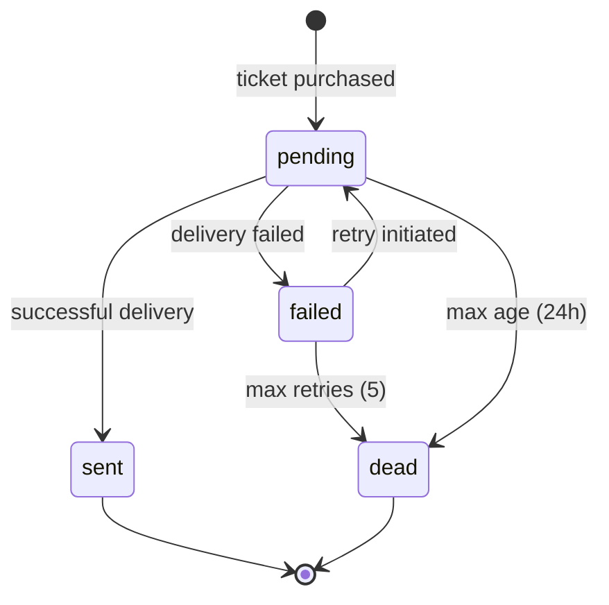

# Email Service

## Overview

The Email Service (`:8084`) is a pure [[kafka]] consumer — it has no public REST API beyond a health check. It consumes `ticket.purchased` events, decrypts the buyer's email from `user_db`, sends a confirmation via a pluggable provider interface, and tracks delivery status. Failed deliveries are retried with exponential backoff and dead-lettered after 5 attempts.

## Responsibilities

- Consume `ticket.purchased` events from Kafka
- **Idempotency**: check `email_status` table for duplicate `booking_ref` before processing
- Fetch and decrypt user email from `user_db.users.email_enc`
- Send confirmation via pluggable `EmailProvider` interface
- Track delivery status in `email_db.email_status` with state machine
- Retry failed deliveries with exponential backoff
- Dead-letter after max retries (5 attempts)

## Interfaces

### REST API

| Method | Path | Auth | Description |
|--------|------|------|-------------|
| `GET` | `/health` | — | Health check only |

### Kafka

Consumes `ticket.purchased` topic. Consumer group ensures at-least-once delivery. Offset committed after successful email send.

## Data Model

Database: `email_db`. Table: `email_status`.

| Column | Type | Notes |
|--------|------|-------|
| `id` | BIGINT UNSIGNED | PK, AUTO_INCREMENT |
| `ticket_id` | BIGINT UNSIGNED | FK → ticket_db.tickets.id |
| `user_id` | BIGINT UNSIGNED | FK → user_db.users.id |
| `recipient_hash` | VARCHAR(64) | SHA-256 of email (no plaintext stored) |
| `status` | ENUM('pending', 'sent', 'failed', 'dead') | |
| `retry_count` | INT UNSIGNED | Max 5 before dead |
| `last_attempt_at` | TIMESTAMP | NULL on creation |
| `created_at` | TIMESTAMP | |

### State Machine



Full schema: [data-model.md](../specs/001-event-ticket-booking/data-model.md#email-service-database-email_db)

## Retry Strategy

Exponential backoff: **1m → 5m → 15m → 1h → 4h**. After 5 failures, status transitions to `dead`. Dead-lettered records remain queryable via the database for manual investigation. See [[email-retry-strategy]].

## Pluggable Email Provider

The `EmailProvider` interface allows swapping providers without changing business logic:

```
type EmailProvider interface {
    Send(ctx context.Context, to string, subject string, body string) error
}
```

Current implementation: `LogProvider` (stdout). Real SMTP/SendGrid is a deploy-time swap-in.

## Cross-references

- [[email-retry-strategy]] — detailed retry and dead-letter design
- [[kafka]] — consumer group, offset management
- [[ticket-service]] — producer of `ticket.purchased` events
- [[mysql]] — email_db schema and cross-database user email read
- [[pii-encryption]] — email decryption at read time
- [[service-decoupling]] — why Kafka over direct HTTP
- [[constitution]] — Principle III (Service Decoupling)
- [[sources/specs]] — traceability to spec requirements
- [[sources/code-structure]] — source location: `services/email/`
