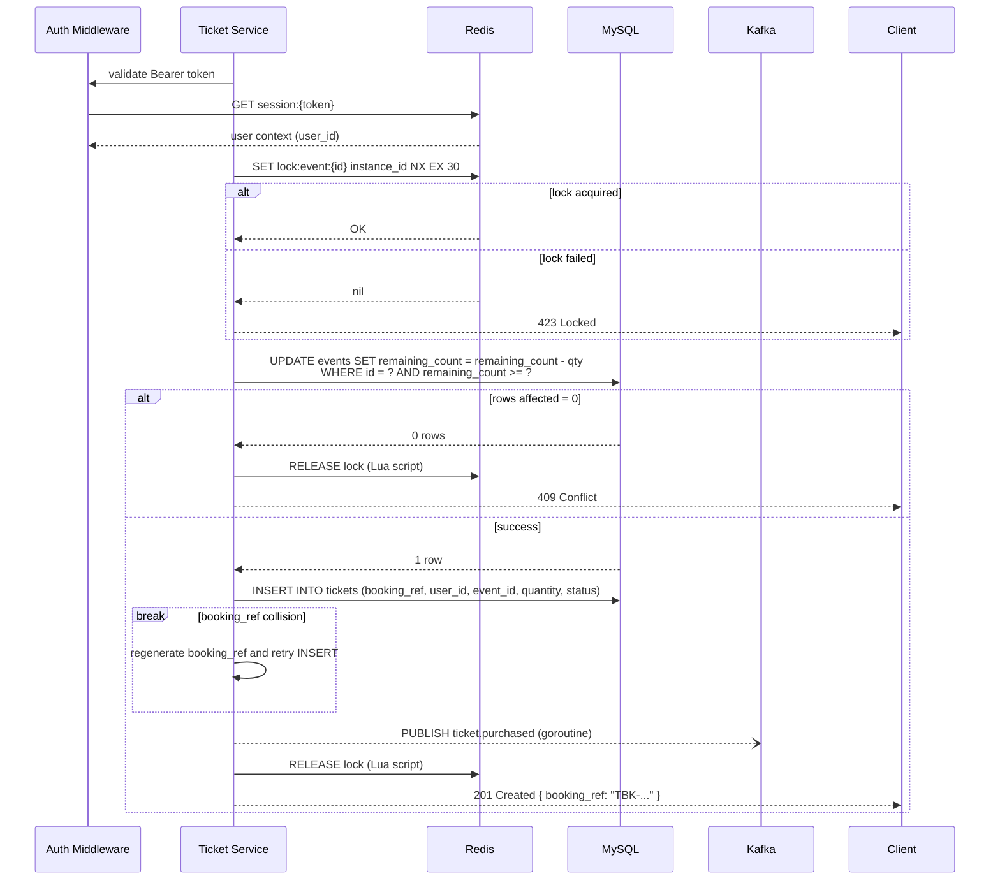

# Ticket Service

## Overview

The Ticket Service (`:8083`) owns the purchase flow — the critical path of the entire system. It uses [[redis]]-based distributed locking to serialize concurrent purchases and prevent double-selling. This is where the core architectural challenge lives.

## Responsibilities

- Purchase tickets with distributed locking (per-event lock)
- Atomic inventory decrement (SQL UPDATE with WHERE clause)
- Generate unique booking references (`TBK-{8 alphanumeric}`)
- Publish `ticket.purchased` to [[kafka]] for async email delivery
- Purchase history retrieval with nested event details and pagination

## Interfaces

### REST API

| Method | Path | Auth | Description |
|--------|------|------|-------------|
| `POST` | `/api/v1/tickets/purchase` | Bearer | Purchase tickets. Body: `{"event_id": 1, "quantity": 2}` |
| `GET` | `/api/v1/tickets` | Bearer | Purchase history with nested event details |

### HTTP Status Codes (Purchase)

| Code | Meaning |
|------|---------|
| `201` | Purchase confirmed |
| `400` | Invalid input |
| `401` | Missing/expired session |
| `409` | Sold out or insufficient tickets |
| `423` | Lock contention — retry with backoff |

### Kafka

Publishes to `ticket.purchased` on successful purchase. Message includes `correlation_id` and `idempotency_key`.

## Purchase Flow (Detailed)

## Data Model

Database: `ticket_db`. Table: `tickets`.

| Column | Type | Notes |
|--------|------|-------|
| `id` | BIGINT UNSIGNED | PK, AUTO_INCREMENT |
| `booking_ref` | CHAR(12) | UNIQUE, format: `TBK-{8 alphanumeric}` |
| `user_id` | BIGINT UNSIGNED | FK → user_db.users.id |
| `event_id` | BIGINT UNSIGNED | FK → event_db.events.id |
| `quantity` | INT UNSIGNED | > 0 |
| `status` | ENUM('confirmed', 'cancelled') | Default 'confirmed' |
| `created_at` | TIMESTAMP | |

Full schema: [data-model.md](../specs/001-event-ticket-booking/data-model.md#ticket-service-database-ticket_db)

## Key Decisions

- **Redis Redlock over PostgreSQL advisory locks** — Redis is connection-agnostic. Lock lifecycle isn't tied to a DB connection. See [[distributed-locking]].
- **Atomic SQL UPDATE, not SELECT-then-UPDATE** — the `WHERE remaining_count >= ?` clause prevents race conditions at the database level as a backstop to the distributed lock.
- **Lock-per-event, not lock-per-ticket** — locking at the event granularity is sufficient for ticket inventory. Per-ticket locking would add complexity with no benefit.
- **Fire-and-forget Kafka publish** — the purchase response doesn't wait for Kafka acknowledgment. Trade-off: possible message loss if the goroutine panics (mitigated by idempotency on the consumer side).

## Known Technical Debt

- **Cross-database read**: Ticket Service reads `event_db.events` directly for availability checks. Tagged `TODO(v2)` — future iteration should use Event Service API calls.
- **Lock granularity**: Lock-per-event could become a bottleneck if a single event experiences extreme demand. Sharded locks could be introduced if needed.

## Cross-references

- [[distributed-locking]] — the locking strategy
- [[redis]] — lock store and session validation
- [[kafka]] — `ticket.purchased` topic
- [[email-service]] — consumer of purchase events
- [[event-service]] — event data for purchase validation
- [[mysql]] — ticket_db and cross-database reads
- [[constitution]] — Principle II (Concurrency Management)
- [[trade-offs]] — v1 scope decisions affecting purchase flow
- [[sources/specs]] — traceability to spec requirements
- [[sources/code-structure]] — source location: `services/ticket/`
