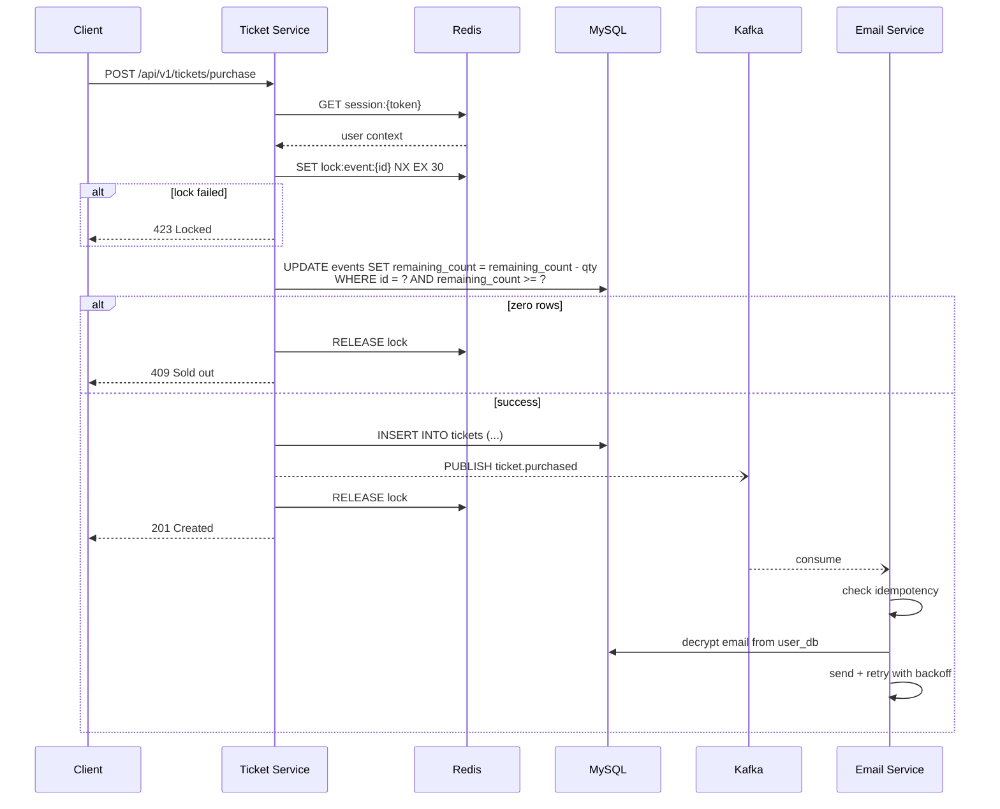

# System Overview

## The Big Picture

This is a **distributed event ticket booking platform** — 4 independently deployable Go microservices that demonstrate production-grade concurrency control. The core problem: prevent double-selling tickets under high contention.

Four services, each owning a single bounded context:

| Service | Port | Responsibility |
|---------|------|----------------|
| [[user-service]] | :8081 | Identity, authentication, PII management |
| [[event-service]] | :8082 | Public catalog of upcoming events (read-only for visitors) |
| [[ticket-service]] | :8083 | Purchase flow with distributed locking |
| [[email-service]] | :8084 | Async Kafka consumer for confirmation delivery |

Infrastructure: [[mysql]] (4 databases), [[redis]] (sessions + locks), [[kafka]] (2 topics).

## The Purchase Flow (Critical Path)

## Governing Principles

All work is governed by the [[constitution]] — 4 MUST principles:
1. **Security-First** — PII encrypted at rest (AES-256-GCM)
2. **Concurrency Management** — Distributed locking for all purchases
3. **Service Decoupling** — Async messaging for all side effects
4. **Test-Driven Development** — 80% minimum coverage on business logic

Violating any principle = PR rejected.

## Key Architectural Decisions

- [[pii-encryption]] — Application-level AES-256-GCM over MySQL TDE (column-level control, DB-agnostic)
- [[distributed-locking]] — Redis Redlock over PostgreSQL advisory locks (connection-agnostic)
- [[service-decoupling]] — Kafka over direct HTTP between services (decouples availability)
- [[session-management]] — Redis-backed opaque tokens over JWTs (instant revocation without blocklist)

## Known Limitations (v1)

- [[ticket-service]] reads `event_db` directly → tagged `TODO(v2)` for Event Service API
- No payment processing — purchase = reservation only
- Single-region deployment only
- [[kafka]] dependency requires glibc-based Docker image (Debian, not Alpine)
- Cross-service reads use shared MySQL; gRPC between services deferred

See [[trade-offs]] for the full v1 scope decisions.

## Testing

[[testing-strategy]]: 112 test functions (87 unit + 24 integration + 1 e2e). Zero Docker dependency. Full suite completes in <15 seconds.

## Development Pipeline

The project was built using a spec-driven AI pipeline: Constitution → Spec → Plan → Tasks → Implement → Converge. Every line of code traces back to a requirement. Full traceability chain preserved in the `specs/` directory.

## Cross-references

- [[constitution]] — governing principles
- [[trade-offs]] — conscious v1 decisions and deferred scope
- [[testing-strategy]] — test pyramid and practices
- [[sources/specs]] — traceability from wiki to raw specification documents
- [[sources/config-files]] — infrastructure and build configuration
- [[sources/code-structure]] — source code layout
