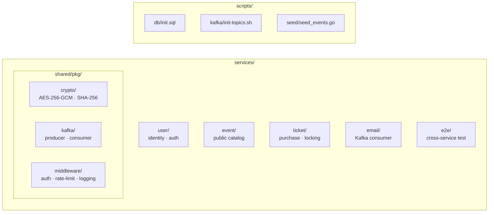

# Source Map: Code Structure

## Overview

The source code is organized into four independent Go services with shared cross-cutting libraries. Each service owns its own bounded context and database. The full source tree is at `services/`.

## Directory Layout

## Service Details

| Directory | Wiki Page | Key Files |
|-----------|-----------|-----------|
| `services/user/` | [[user-service]] | handler, service, repository, models |
| `services/event/` | [[event-service]] | handler, service, repository, models |
| `services/ticket/` | [[ticket-service]] | handler, service, repository, models, lock manager |
| `services/email/` | [[email-service]] | consumer handler, email provider interface, status repository |
| `services/shared/pkg/crypto/` | [[pii-encryption]] | encrypt, decrypt, hash functions |
| `services/shared/pkg/kafka/` | [[kafka]], [[service-decoupling]] | producer, consumer, event envelope types |
| `services/shared/pkg/middleware/` | [[session-management]] | auth middleware (Redis lookup), rate limiter, request logging |

## Test Files

Tests are co-located with their source:

| Service | Unit Tests | Integration Tests | Wiki Page |
|---------|-----------|-------------------|-----------|
| User | `services/user/*_test.go` | `services/user/*_test.go` | [[user-service]], [[testing-strategy]] |
| Event | `services/event/*_test.go` | `services/event/*_test.go` | [[event-service]], [[testing-strategy]] |
| Ticket | `services/ticket/*_test.go` | `services/ticket/*_test.go` | [[ticket-service]], [[testing-strategy]], [[distributed-locking]] |
| Email | `services/email/*_test.go` | `services/email/*_test.go` | [[email-service]], [[testing-strategy]], [[email-retry-strategy]] |

## Ingest History

- **2025-07-16**: Full bootstrap — code structure cataloged. Individual service source files not yet deeply ingested — pending future ingest operations. See [[log|log.md#2025-07-16-ingest-initial-wiki-bootstrap]].
